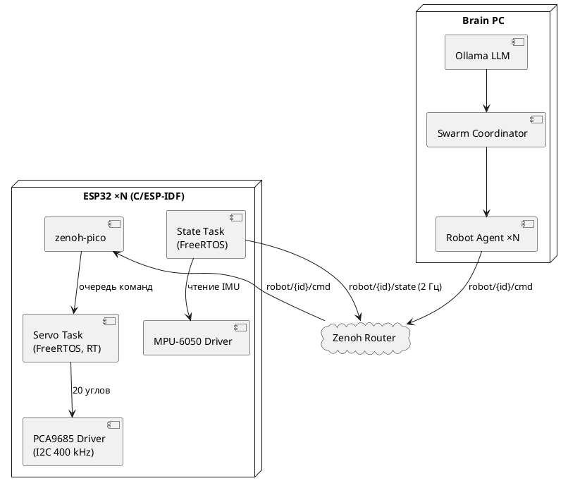
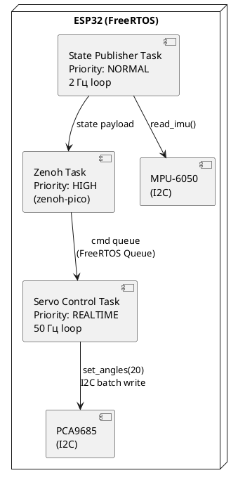
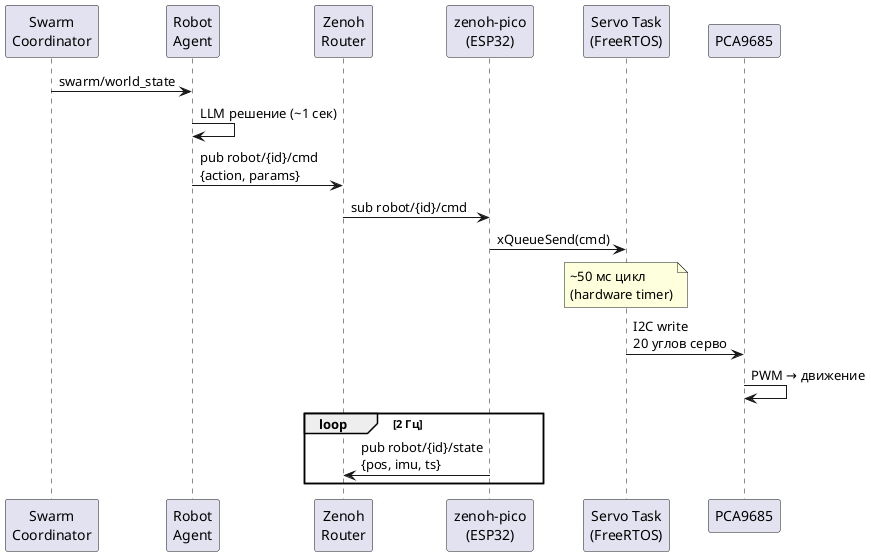

# HLD Программный стек v3.1

Архитектура ПО системы управления роем гуманоидных роботов.
Транспорт: **Zenoh везде** — PC-сторона и ESP32 через zenoh-pico.
ESP32 прошивка: **C/ESP-IDF** (не MicroPython).

> Принцип: весь ПО отлаживается на виртуальных роботах (Phase 0, $0). Переход на железо — замена нижнего слоя.

## Версии

| Версия | Дата | Изменения | Статус |
|--------|------|-----------|--------|
| v1.0 | — | Первый вариант, MQTT | архив |
| v2.1 | — | 5-слойная арх., MQTT | архив |
| v3.0 | 2026-03-16 | Zenoh+UDP вместо MQTT | архив |
| v3.1 | 2026-03-16 | Полный Zenoh (zenoh-pico на ESP32), убран UDP и Robot Gateway | черновик |

Обоснование перехода на C/ESP-IDF: GC-паузы MicroPython 10–50 мс создают jitter серво; zenoh-pico не имеет MicroPython-биндинга.

---

## Диаграмма 1 — Общая архитектура системы



---

## Диаграмма 2 — Внутреннее устройство ESP32 (FreeRTOS)



---

## Диаграмма 3 — Поток команды движения (sequence)



---

## Слои системы

### Слой 1 — LLM (локальный)

| Параметр | Значение |
|----------|---------|
| Runtime | Ollama |
| Модель | Phi-3 Mini (2.2 ГБ) / Llama 3.2 3B |
| API | http://localhost:11434/v1 |
| Temperature агент | 0.3 |
| Temperature координатор | 0.2 |

### Слой 2 — Swarm Coordinator

- Python asyncio, цикл: **5 сек**
- Публикует: `swarm/world_state`
- Получает: `swarm/events`

### Слой 3 — Robot Agents ×N

- Один процесс = один агент = один робот
- Цикл решений: **1 сек**
- Подписка: `robot/{id}/state`, `swarm/world_state`
- Публикация: `robot/{id}/cmd`

### Слой 4 — Transport Layer

**Единый протокол — Zenoh везде.**

**Zenoh QoS для motion команд:**
```
Priority::RealTime + CongestionControl::Drop
→ near-UDP latency (~1–5 мс) без отдельного UDP стека
```

**Топики:**

| Топик | Направление | QoS | Частота |
|-------|-------------|-----|---------|
| `robot/{id}/cmd` | Агент → ESP32 | RealTime + Drop | по решению |
| `robot/{id}/state` | ESP32 → Агент | BestEffort | 2 Гц |
| `robot/{id}/sensor` | ESP32 → Агент | BestEffort | по событию |
| `swarm/world_state` | Координатор → все | Reliable | 0.2 Гц |
| `swarm/events` | любой → Координатор | Reliable | по событию |

### Слой 5 — Robot Body (фазозависимый)

| Фаза | Реализация | Транспорт |
|------|-----------|-----------|
| Phase 0 | Python Virtual Robot | Zenoh (eclipse-zenoh) |
| Phase 1 | Webots контроллер | Zenoh (eclipse-zenoh) |
| Phase 2 | ESP32 C/ESP-IDF | Zenoh (zenoh-pico) |

---

## Стек и зависимости

| Компонент | Технология |
|-----------|-----------|
| Python агенты | eclipse-zenoh |
| Zenoh Router | zenohd binary |
| LLM runtime | Ollama + Phi-3 Mini |
| Dashboard | FastAPI + WebSocket |
| Симулятор | Webots R2023b+ |
| ESP32 runtime | C/ESP-IDF |
| ESP32 транспорт | zenoh-pico (idf component) |

---

## Иерархия управления

```
LLM (1–5 сек)              → стратегия через Zenoh
Агент (1 сек)              → robot/{id}/cmd через Zenoh (RealTime QoS)
ESP32 Zenoh Task           → FreeRTOS Queue → Servo Task
Servo Task (50 Гц, RT)    → IK → PCA9685 I2C → 20 серво
```

---

## ESP32 C/ESP-IDF — ключевые решения

| Решение | Почему |
|---------|--------|
| FreeRTOS Servo Task с `REALTIME` priority | Точный 50 Гц без jitter, вытесняет всё кроме прерываний |
| zenoh-pico как IDF component | `idf_component_manager` → `idf add zenohpico` |
| I2C batch write PCA9685 | Обновление всех 20 серво за одну транзакцию (<1 мс) |
| Hardware timer для servo loop | Без GC пауз, детерминированный тайминг |
| Motion command queue | FreeRTOS Queue 10 элементов, Zenoh task → Servo task |

---

## Debug инфраструктура

| Инструмент | Применение |
|-----------|-----------|
| `z_sub -k "robot/**"` | Live просмотр всех Zenoh топиков |
| `z_scout` | Обнаружение участников сети |
| Dashboard FastAPI :8000 | Визуализация позиций |
| JTAG + OpenOCD | Дебаг ESP32 с брейкпоинтами |
| ESP-IDF Monitor | Логи по UART, panic decoder |
| Ollama logs | Решения LLM |

---

## Полнота разделов

| Раздел | Готовность | Блокер |
|--------|------------|--------|
| Слои 1–3 (PC сторона) | 100% | — |
| Zenoh топики + QoS | 90% | Конфиг роя N > 4 |
| Phase 0 Virtual Robot | 85% | Обновить под eclipse-zenoh |
| Phase 1 Webots | 75% | URDF нет |
| ESP32 C/ESP-IDF скелет | 50% | Код не написан |
| IK (обратная кинематика) | 30% | Алгоритм не выбран |

**Общая готовность: ~72%**

---

## Связанные документы

- [[../index|HLD Навигатор]]
- [[../hardware/hld_hardware_v1_1|HLD Железо v1.1]]
- [[../phases/hld_phase1_v1_1|HLD Фаза 1 v1.1]]
- [[../../research/robot-network-architecture/artefacts/architectures/zenoh_distributed_architecture|Распределённая архитектура Zenoh]]
- [[../../research/robot-network-architecture/artefacts/protocols/protocol_comparison|Сравнение протоколов]]
