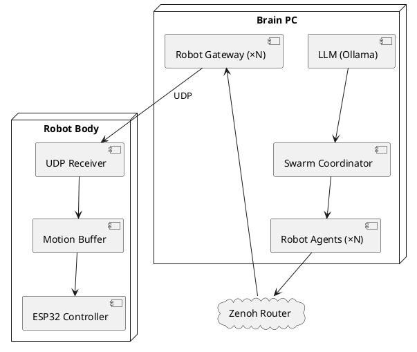

# HLD Программный стек v3.0

Архитектура ПО системы управления роем гуманоидных роботов.
Транспорт: **Zenoh** (сервисы) + **UDP** (управление движением).

> Принцип: весь ПО пишется на виртуальных роботах (Phase 0, $0). Переход на железо — замена нижнего слоя.

## Версии

| Версия | Дата | Изменения | Статус |
|--------|------|-----------|--------|
| v1.0 | — | Первый вариант | архив |
| v2.1 | — | 5-слойная арх., MQTT транспорт | архив |
| v3.0 | 2026-03-16 | Zenoh+UDP вместо MQTT. Основание: [[../../research/robot-network-architecture/artefacts/protocols/protocol_comparison\|Сравнение протоколов]] | черновик |

## Диаграмма архитектуры



## Слои системы

### Слой 1 — LLM (локальный)

| Параметр | Значение |
|----------|---------|
| Runtime | Ollama |
| Модель | Phi-3 Mini (2.2 ГБ) / Llama 3.2 3B |
| API | http://localhost:11434/v1 |
| Temperature (агент) | 0.3 |
| Temperature (координатор) | 0.2 |

### Слой 2 — Swarm Coordinator

- Python asyncio, цикл стратегии: **5 сек**
- Публикует: `swarm/world_state` (Zenoh)
- Получает: `swarm/events` (Zenoh)
- Использует LLM для стратегических решений

### Слой 3 — Robot Agents (×N процессов)

- Один процесс = один агент = один робот
- Цикл решений: **1 сек**
- Подписка (Zenoh): `robot/{id}/state`, `swarm/world_state`
- Публикация (Zenoh): `robot/{id}/cmd`
- Запрашивает LLM → решает → публикует команду

### Слой 4 — Transport Layer

**Два канала:**

| Канал | Протокол | Применение | Latency | Библиотека |
|-------|----------|------------|---------|------------|
| Сервисный | Zenoh | Состояние, стратегия, события | ~5–20 мс | eclipse-zenoh |
| Управление движением | UDP | Команды серво реального времени | минимальная | socket (stdlib) |

**Причина смены протокола:** MQTT заменён на Zenoh+UDP.
Подробнее: [[../../research/robot-network-architecture/artefacts/protocols/protocol_comparison|Сравнение протоколов]]

**Zenoh топики:**

| Топик | Направление | Частота |
|-------|-------------|---------|
| `robot/{id}/state` | ESP32 → агент | 2 Гц |
| `robot/{id}/sensor` | ESP32 → агент | по событию |
| `robot/{id}/cmd` | агент → Robot Gateway | по решению |
| `swarm/world_state` | координатор → все | 0.2 Гц |
| `swarm/events` | любой → координатор | по событию |

**UDP (управление движением):**
- Порт: `9000 + robot_id`
- Формат пакета: `{"servos": [90, 45, 0, ...], "timestamp": 1704067200.123}`
- Размер: ≤ 256 байт (20 DOF × uint16 + заголовок)
- Потеря пакета: Motion Buffer держит последнее состояние

> ⚠️ Открытый вопрос: бинарный формат (struct pack) vs JSON — не финализировано

### Слой 5 — Robot Body (фазозависимый)

| Фаза | Реализация | Входящий транспорт |
|------|-----------|-------------------|
| Phase 0 | Python Virtual Robot | Zenoh + UDP mock |
| Phase 1 | Webots контроллер | Zenoh + UDP via Gateway |
| Phase 2 | ESP32 + MicroPython | UDP (motion) + Zenoh (state) |

### Robot Gateway (новый компонент в v3.0)

Отсутствовал в v2.1. Граничный компонент между сервисным уровнем и реальным временем.

- Принимает: `robot/{id}/cmd` через Zenoh
- Транслирует: high-level команду → углы 20 серво (IK)
- Отправляет: UDP пакет на Robot Body (порт 9000+id)
- Fallback: при потере связи повторяет последний пакет

> ⚠️ API-контракт Gateway не финализирован (блокер Phase 1)

## Иерархия управления

```
LLM (медленно, 1–5 сек)    → стратегические решения
Агент (1 сек)               → высокоуровневая команда (move / attack / defend)
Robot Gateway               → IK → углы 20 серво
ESP32 (50 мс)               → PWM → физическое движение
```

## Стек и зависимости

| Компонент | Технология | Версия |
|-----------|-----------|--------|
| Python | 3.11+ | — |
| Zenoh клиент | eclipse-zenoh (PyPI) | latest |
| Zenoh Router | zenohd binary | latest |
| LLM runtime | Ollama | latest |
| LLM модель | Phi-3 Mini | 3.8B |
| API клиент | openai SDK | — |
| Dashboard | FastAPI + WebSocket | — |
| Симулятор | Webots R2023b+ | — |
| ESP32 | MicroPython | v1.21+ |

## Debug инфраструктура

| Инструмент | Применение |
|-----------|-----------|
| `z_sub -k "robot/**"` | Live просмотр Zenoh топиков |
| `z_scout` | Обнаружение участников сети |
| Dashboard (FastAPI :8000) | Визуализация позиций роботов |
| Wireshark | Мониторинг UDP пакетов движения |
| Ollama logs | Решения LLM |

## Полнота разделов

| Раздел | Готовность | Блокер |
|--------|------------|--------|
| Слои 1–3 (LLM, Coordinator, Agents) | 100% | — |
| Zenoh топики | 85% | Схема роя N > 4 |
| UDP протокол | 70% | Формат пакета (JSON vs binary) |
| Robot Gateway | 50% | API-контракт |
| Phase 0 Virtual Robot | 80% | Обновить код под eclipse-zenoh |
| Phase 1 Webots | 75% | URDF модели нет |
| Phase 2 ESP32 | 60% | UDP firmware |
| IK (обратная кинематика) | 30% | Алгоритм не выбран |

**Общая готовность: ~73%**

## Связанные документы

- [[../index|HLD Навигатор]]
- [[../hardware/hld_hardware_v1_1|HLD Железо v1.1]]
- [[../phases/hld_phase1_v1_1|HLD Фаза 1 v1.1]]
- [[../../research/robot-network-architecture/artefacts/architectures/hybrid_zenoh_udp_architecture|Гибридная архитектура Zenoh+UDP]]
- [[../../research/robot-network-architecture/artefacts/protocols/protocol_comparison|Сравнение протоколов]]
