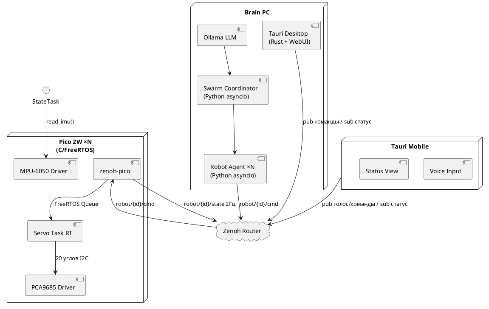

# HLD Программный стек v3.2

Архитектура ПО системы управления роем гуманоидных роботов.
Транспорт: **Zenoh везде**. Прошивка: **C/FreeRTOS + zenoh-pico**. UI: **Tauri 2.0**.

> Принцип: весь ПО отлаживается на виртуальных роботах (Phase 0, $0). Переход на железо — замена нижнего слоя.

## Версии

| Версия | Дата | Изменения | Статус |
|--------|------|-----------|--------|
| v1.0 | — | Первый вариант, MQTT | архив |
| v2.1 | — | 5-слойная арх., MQTT | архив |
| v3.0 | 2026-03-16 | Zenoh+UDP вместо MQTT | архив |
| v3.1 | 2026-03-16 | Полный Zenoh, убран UDP и Robot Gateway | архив |
| v3.2 | 2026-03-16 | Tauri 2.0 вместо FastAPI dashboard, UI слой, голосовые сценарии | черновик |
| v3.3 | 2026-03-17 | swarm/task/{id} — адресная раздача задач агентам (ADR: Вариант B) | черновик |

---

## Диаграмма 1 — Общая архитектура системы



---

## Слои системы

### Слой 1 — LLM (локальный)

| Параметр | Значение |
|----------|---------|
| Runtime | Ollama |
| Модель | Phi-3 Mini (2.2 ГБ) / Llama 3.2 3B |
| API | http://localhost:11434/v1 |
| Temperature агент | 0.3 |
| Temperature координатор | 0.2 |

### Слой 2 — Swarm Coordinator

- Python asyncio, цикл: **5 сек**
- Публикует: `swarm/world_state`, `swarm/task/{id}` (по событию)
- Получает: `swarm/events`, `ui/voice_cmd`
- Раздача задач агентам: топик `swarm/task/{id}` — адресно, событийно, Reliable QoS
- Масштабирование: O(N) трафик — агент подписан только на свой топик

### Слой 3 — Robot Agents ×N

- Один процесс = один агент = один робот
- Цикл решений: **1 сек**
- Подписка: `robot/{id}/state`, `swarm/world_state`, `swarm/task/{id}`
- Публикация: `robot/{id}/cmd`, `swarm/events`
- LLM translates high-level intent → детерминированные параметры команды

### Слой 4 — Transport Layer

**Единый протокол — Zenoh везде.**

| Топик | Направление | QoS | Частота |
|-------|-------------|-----|---------|
| `robot/{id}/cmd` | Агент → Pico | RealTime + Drop | по решению |
| `robot/{id}/state` | Pico → Агент | BestEffort | 2 Гц |
| `swarm/world_state` | Координатор → все | Reliable | 0.2 Гц |
| `swarm/task/{id}` | Координатор → Агент | Reliable | по событию |
| `swarm/events` | любой → Координатор | Reliable | по событию |
| `ui/voice_cmd` | Tauri → Coordinator | Reliable | по событию |
| `ui/status` | Coordinator → Tauri | BestEffort | 1 Гц |

### Слой 5 — Robot Body (фазозависимый)

| Фаза | Реализация | Транспорт |
|------|-----------|-----------|
| Phase 0 | Python Virtual Robot | Zenoh (eclipse-zenoh) |
| Phase 1 | Webots контроллер | Zenoh (eclipse-zenoh) |
| Phase 2 | Pico 2W C/FreeRTOS | Zenoh (zenoh-pico) |

### Слой 6 — UI Layer (Tauri 2.0)

**Принцип:** UI — тонкий клиент. Вся логика остаётся на Brain PC.

| Платформа | Реализация | Роль |
|-----------|-----------|------|
| Desktop (Brain PC) | Tauri 2.0 + Rust backend | Мониторинг, конфигурация, сценарии |
| Mobile (iOS/Android) | Tauri 2.0 | Голосовые команды, быстрые действия, статус |

**Монорепо — структура:**

```
apps/
  desktop/      # Tauri 2.0 Desktop (Brain PC)
  mobile/       # Tauri 2.0 Mobile (iOS / Android)
packages/
  ui/           # Shared React/Svelte компоненты
  zenoh-ipc/    # Tauri plugin: Zenoh ↔ WebView bridge (Rust)
```

**Rust backend Tauri отвечает за:**
- Zenoh pub/sub (нативный eclipse-zenoh Rust)
- Ollama HTTP API клиент
- Трансляция UI событий → Zenoh топики

---

## UI сценарии взаимодействия

### Основной паттерн — голосовое управление

```
Пользователь: "Робот 1, подойди к столу"
     ↓
Tauri (STT → текст)
     ↓  ui/voice_cmd
Swarm Coordinator → LLM
     ↓
LLM: intent parsing → action plan
     ↓  robot/1/cmd
Robot Agent → Zenoh → Pico → серво
     ↓  ui/status
Tauri: "Робот 1 выполняет: движение к точке A"
```

### Сценарии UI

| Сценарий | Канал | Описание |
|----------|-------|---------|
| Голосовая команда | Голос → STT → LLM | Естественный язык → план действий |
| Ручное управление | Джойстик/слайдеры в UI | Прямое управление без LLM (отладка) |
| Сценарий поведения | Кнопка → preset | Запуск предзаданной последовательности |
| Мониторинг | Авто, push | Статус всех роботов в реальном времени |
| Экстренная остановка | Кнопка (приоритет) | Прямой стоп всех серво, минуя LLM |

### Открытые вопросы UI

- [x] ~~FastAPI Dashboard vs Tauri~~ → **решено: Tauri 2.0, монорепо, Desktop + Mobile** (2026-03-17)
- [x] ~~Frontend фреймворк~~ → **решено: Nuxt 4 (Vue 3), шаблон готов** (2026-03-17)
- [x] ~~STT движок~~ → **whisper.cpp + large-v3-russian + CUDA** (2026-03-17). Brain PC RTX 3050 6GB: ~3GB VRAM, latency ~0.3-0.5с/фраза.
- [ ] Формат голосовых команд — свободная речь vs ключевые слова (Q-14)
- [ ] Визуализация 3D состояния робота в UI — нужна ли на старте? (Q-12)
- [ ] Аутентификация мобильного клиента (Q-13)

---

## Стек и зависимости

| Компонент | Технология |
|-----------|-----------|
| Python агенты | eclipse-zenoh Python |
| Zenoh Router | zenohd binary |
| LLM runtime | Ollama + Phi-3 Mini |
| Desktop UI | Tauri 2.0 (Rust + WebUI) |
| Mobile UI | Tauri 2.0 (iOS / Android) |
| Монорепо | pnpm workspaces (apps/desktop, apps/mobile, packages/ui, packages/zenoh-ipc) |
| Frontend WebUI | Nuxt 4 (Vue 3 + Vite) — шаблон готов |
| Симулятор | Webots R2023b+ |
| Pico 2W runtime | C/FreeRTOS |
| Pico 2W транспорт | zenoh-pico |

---

## Иерархия управления

```
Пользователь (голос/UI)    → natural language intent
LLM (1–5 сек)              → стратегия: ЧТО делать
Агент (1 сек)              → robot/{id}/cmd через Zenoh (RealTime QoS)
Pico 2W Zenoh Task         → FreeRTOS Queue → Servo Task
Servo Task (50 Гц, RT)    → IK → PCA9685 I2C → 20 серво
```

---

## Pico 2W / ESP32 C/FreeRTOS — ключевые решения

| Решение | Почему |
|---------|--------|
| FreeRTOS Servo Task с `REALTIME` priority | Точный 50 Гц без jitter |
| zenoh-pico | Нативный C транспорт |
| I2C batch write PCA9685 | Все 20 серво за одну транзакцию (<1 мс) |
| Hardware timer для servo loop | Детерминированный тайминг |
| Motion command queue | FreeRTOS Queue 10 элементов |

---

## Debug инфраструктура

| Инструмент | Применение |
|-----------|-----------|
| `z_sub -k "robot/**"` | Live просмотр всех Zenoh топиков |
| `z_scout` | Обнаружение участников сети |
| Tauri Desktop UI | Визуализация состояния роботов |
| JTAG + OpenOCD | Дебаг Pico 2W / ESP32 |
| Ollama logs | Решения LLM |

---

## Полнота разделов

| Раздел                    | Готовность | Блокер                       |
| ------------------------- | ---------- | ---------------------------- |
| Слои 1–3 (PC сторона)     | 100%       | —                            |
| Zenoh топики + QoS        | 90%        | Конфиг роя N > 4             |
| UI слой (Tauri)           | 30%        | Не реализован, STT не выбран |
| Phase 0 Virtual Robot     | 85%        | Обновить под eclipse-zenoh   |
| Phase 1 Webots            | 75%        | URDF нет                     |
| Pico 2W C/FreeRTOS скелет | 50%        | Код не написан               |
| IK (обратная кинематика)  | 30%        | Алгоритм не выбран           |

**Общая готовность: ~66%**

---

## Связанные документы

- [[../index|HLD Навигатор]]
- [[../hardware/hld_hardware_v1_2|HLD Железо v1.2]]
- [[../phases/hld_phase1_v1_1|HLD Фаза 1 v1.2]]
- [[../../research/robot-network-architecture/artefacts/architectures/zenoh_distributed_architecture|Распределённая архитектура Zenoh]]
- [[../../research/robot-hardware-research/index|Исследование: Hardware решения]]
