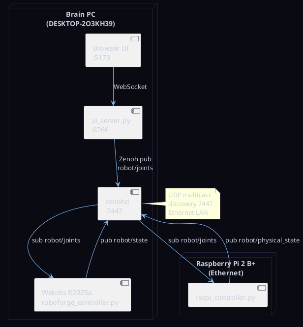
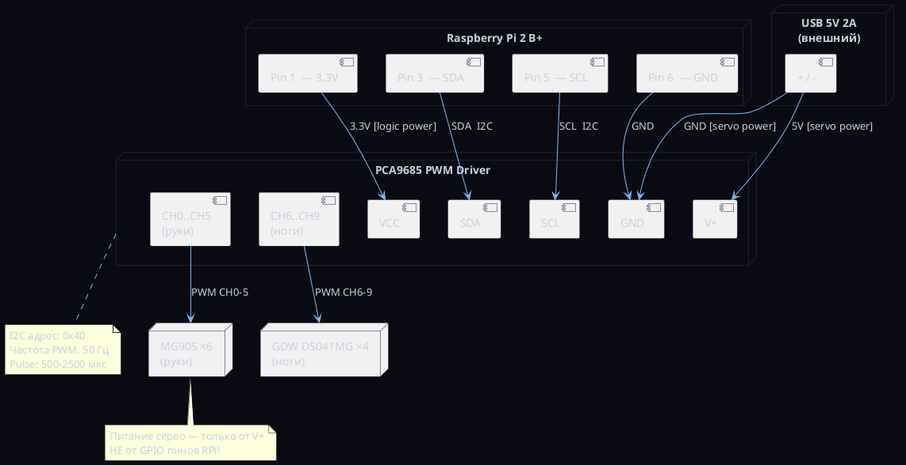

# Схема подключения — EXP-006 Hardware-in-the-Loop

Связан с: [[../../experiments/EXP-006_hardware_in_the_loop|EXP-006]]

## Сетевая архитектура

## Схема подключения железа (RPi → PCA9685 → Сервы)

## Маппинг суставов

| Joint | Тип | CH | Диапазон | Центр (0 rad) |
|-------|-----|----|----------|---------------|
| left_shoulder_pitch | MG90S | 0 | 0–180° | 90° |
| left_elbow_pitch | MG90S | 1 | 0–180° | 90° |
| left_wrist_pitch | MG90S | 2 | 0–180° | 90° |
| right_shoulder_pitch | MG90S | 3 | 0–180° | 90° |
| right_elbow_pitch | MG90S | 4 | 0–180° | 90° |
| right_wrist_pitch | MG90S | 5 | 0–180° | 90° |
| left_hip_pitch | GDW DS041MG | 6 | 0–180° | 90° |
| left_knee_pitch | GDW DS041MG | 7 | 90–180° | 90° |
| right_hip_pitch | GDW DS041MG | 8 | 0–180° | 90° |
| right_knee_pitch | GDW DS041MG | 9 | 90–180° | 90° |
