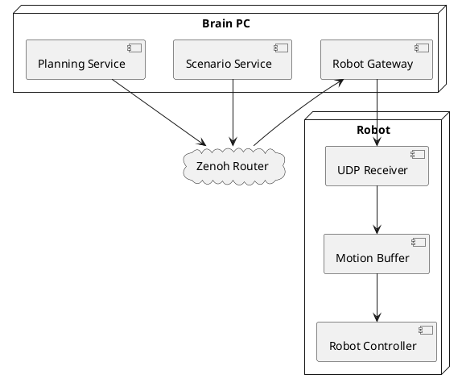

# Гибридная архитектура (Zenoh + UDP)

Гибридная архитектура: сервисный уровень использует Zenoh, управление роботом передаётся через UDP для минимизации задержки.

## Характеристики

| Параметр | Значение |
|---|---|
| Протокол (сервисы) | Zenoh |
| Протокол (управление) | UDP |
| Масштабируемость | Средняя |
| Latency управления | Минимальная |

## Обоснование выбора

- UDP обеспечивает минимальные задержки для передачи движений
- Zenoh обеспечивает надёжную маршрутизацию между сервисами
- Motion Buffer защищает от потери пакетов UDP

## Связанные документы

- [[zenoh_distributed_architecture|Распределённая архитектура (Zenoh)]]
- [[../protocols/protocol_comparison|Сравнение протоколов]]
- [[../flows/scenario_execution_flow|Поток выполнения сценария]]
