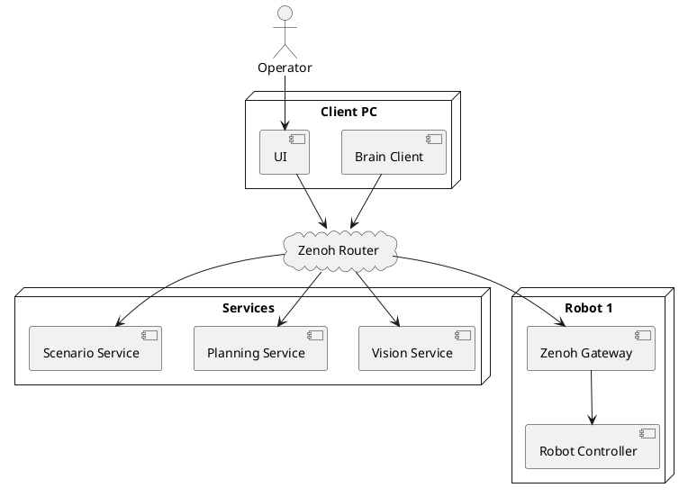

# Распределённая архитектура робота (Zenoh)

Полностью распределённая архитектура на основе протокола Zenoh. Все компоненты взаимодействуют через центральный Zenoh Router.

## Характеристики

| Параметр | Значение |
|---|---|
| Протокол | Zenoh |
| Топология | Централизованный роутер |
| Масштабируемость | Высокая |
| Latency | Низкая |

## Связанные документы

- [[hybrid_zenoh_udp_architecture|Гибридная архитектура (Zenoh + UDP)]]
- [[../protocols/protocol_comparison|Сравнение протоколов]]
