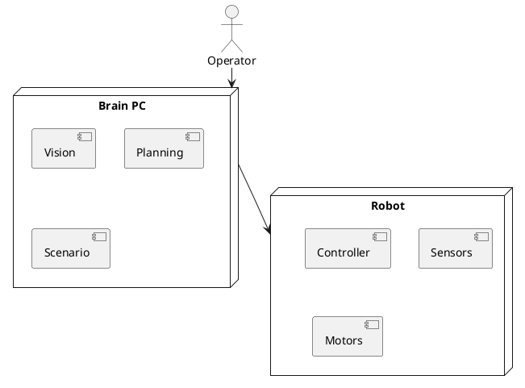

# Обзор системы

Высокоуровневая диаграмма системы управления роботом.

## Связанные документы

- [[../index|Индекс артефактов]]
- [[../architectures/zenoh_distributed_architecture|Распределённая архитектура]]
