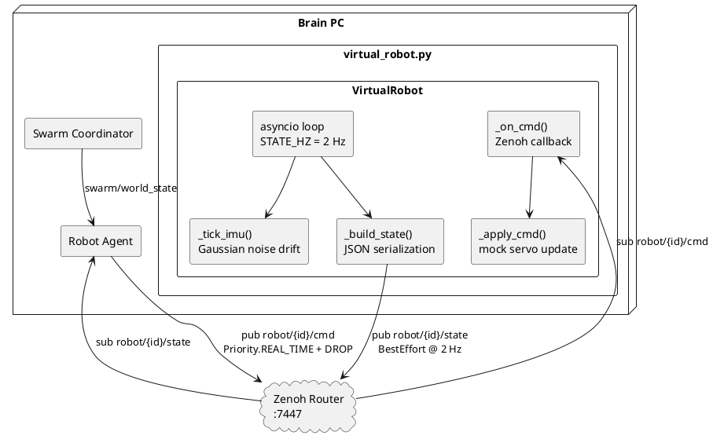
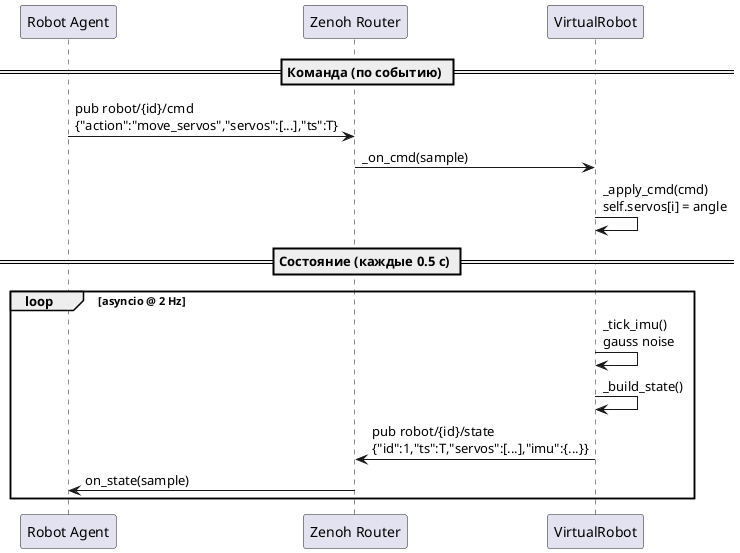

# Virtual Robot — Компонентная диаграмма (Phase 0)

Визуальное представление `services/virtual_robot/virtual_robot.py`.

## Компонентная диаграмма

## Диаграмма последовательности — один цикл

## Топики

| Топик | Тип | Направление |
|-------|-----|-------------|
| `robot/{id}/cmd` | sub | Agent → VirtualRobot |
| `robot/{id}/state` | pub | VirtualRobot → Agent |

## Связанные файлы

- [[../../../../../services/virtual_robot/virtual_robot.py|virtual_robot.py]] (код)
- [[../../../hld/software/hld_software_v3_2|HLD Программный стек v3.2]]
- [[../../../hld/phases/hld_phase1_v1_1|HLD Фаза 1 v1.3]]
