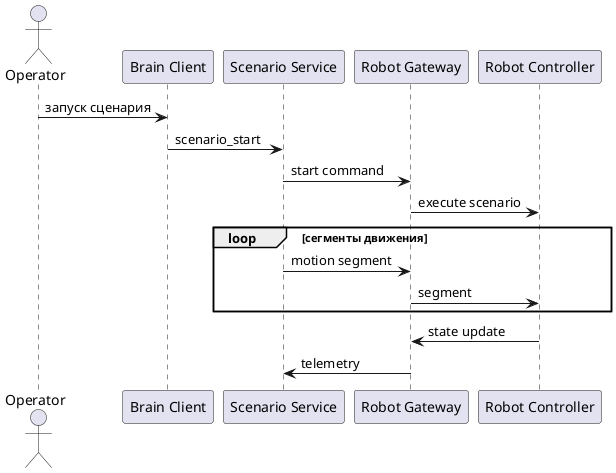

# Поток выполнения сценария

Последовательность взаимодействия компонентов при запуске и выполнении двигательного сценария на роботе.

## Связанные документы

- [[../architectures/hybrid_zenoh_udp_architecture|Гибридная архитектура (Zenoh + UDP)]]
- [[../index|Индекс артефактов]]
