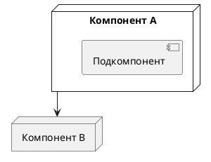

# Методология исследования архитектуры системы

Универсальная методика для AI-агентов и инженеров. Применяется при анализе технологий, архитектур и протоколов взаимодействия.

## Рабочий процесс

1. **Постановка задачи** — тип системы, требования, ограничения, масштаб, ожидаемый результат
2. **Декомпозиция** — компоненты, логические уровни, роли, точки взаимодействия, критические контуры
3. **Анализ технологий** — категории технологий, список решений, характеристики, сильные/слабые стороны
4. **Исследование архитектур** — индустриальные решения, паттерны, аналогичные проекты, лучшие практики
5. **Построение вариантов** — централизованные, распределённые, гибридные архитектуры + диаграммы
6. **Анализ потоков** — типы сообщений, потоки команд и состояний, критические контуры управления
7. **Сравнение решений** — latency, масштабируемость, устойчивость к отказам, соответствие требованиям
8. **Выводы** — рекомендуемая архитектура, риски, ограничения, дальнейшие шаги

## Генерация артефактов

Результат исследования — папка `artefacts/` со структурой:

```
artefacts/
├── index.md
├── architectures/
├── flows/
├── protocols/
└── diagrams/
```

## Правила документирования

- Markdown + Obsidian wiki-links `[[...]]`
- Один файл — один артефакт
- Диаграммы в PlantUML
- Навигация через `index.md`
- Минимум текста — максимум структуры

## Использование PlantUML



Типы диаграмм: `component`, `sequence`, `deployment`

## Требования к индексам

Каждый `index.md` должен содержать:
- Краткое описание (1–2 предложения)
- Список ссылок на артефакты с группировкой по типу

## Связанные документы

- [[../claude_rules|Правила для Claude-агентов]]
- [[../templates/research_template|Шаблон исследования]]
