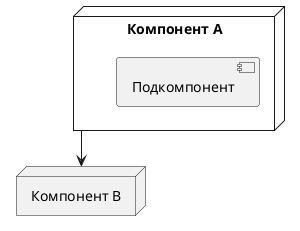

# [Название архитектуры]

Краткое описание архитектуры (1–2 предложения).

## Диаграмма

## Характеристики

| Параметр | Значение |
|---|---|
| Протокол | |
| Топология | |
| Масштабируемость | |
| Latency | |

## Обоснование

- Преимущества:
- Недостатки:
- Условия применения:

## Связанные документы

- [[../index|Индекс артефактов]]
- [[../protocols/protocol_comparison|Сравнение протоколов]]
